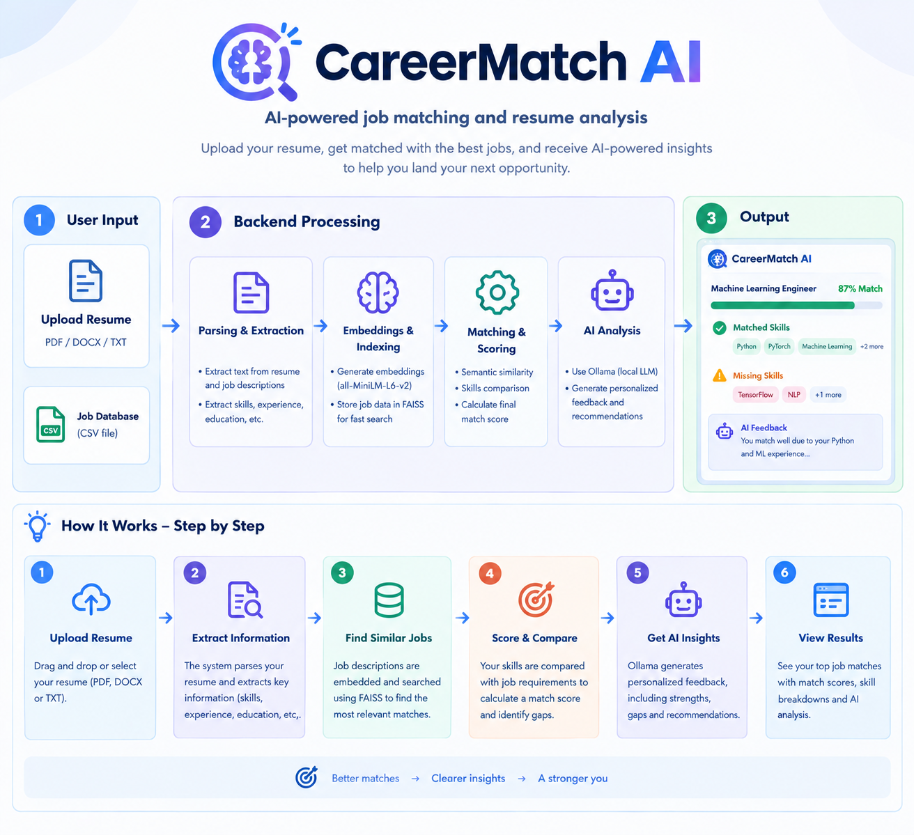
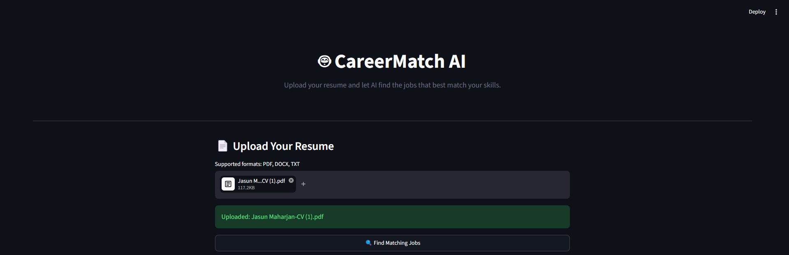
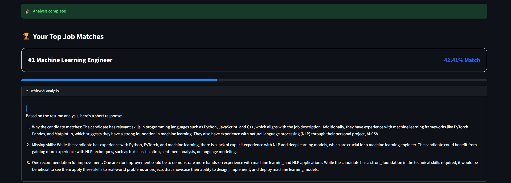
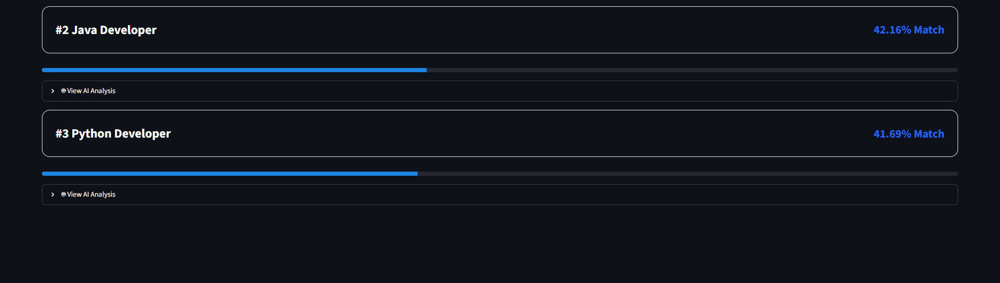

# CareerMatch AI

## AI-powered resume and job matching platform

CareerMatch AI is an AI-powered job matching application that analyzes a
user's resume and identifies the most relevant job opportunities. The
system extracts resume text from PDF, DOCX, or TXT files, converts
resume and job descriptions into semantic embeddings, uses a vector
search system to retrieve relevant jobs, and uses a local Ollama
language model to generate personalized feedback about why the candidate
matches, which skills may be missing, and how the candidate can improve.
The application provides the results through a Streamlit web interface.

## Workflow



## User Instructions

### 1. Start the application

Open a terminal in the project directory and run:

``` bash
streamlit run app.py
```

### 2. Upload your resume

Use the upload area in the CareerMatch AI dashboard and select a resume
in one of the supported formats:

-   PDF
-   DOCX
-   TXT

### 3. Find matching jobs

Click:

``` text
Find Matching Jobs
```

The application will process the resume and search the available job
dataset.

### 4. Review your results

The dashboard displays the top matching jobs, including:

-   Job title
-   Match score
-   AI-generated analysis
-   Reasons for the match
-   Potentially missing skills
-   Recommendations for improvement
-   Job description

### 5. Make sure Ollama is running

The AI feedback feature requires a locally installed and running Ollama
model. For example:

``` bash
ollama run llama3.2
```

The model configured in the application must match the model available
in your local Ollama installation.

## Demo






## Developer Instructions

### Prerequisites

Make sure the following are installed:

-   Python 3.10+
-   Ollama
-   A compatible Ollama language model

### Install Python dependencies

From the project root:

``` bash
python -m pip install streamlit
python -m pip install pypdf
python -m pip install python-docx
python -m pip install sentence-transformers
python -m pip install scikit-learn
python -m pip install faiss-cpu
python -m pip install pandas
python -m pip install requests
```

### Project structure

``` text
CareerMatch-AI/
│
├── app.py
│
├── data/
│   ├── resume/
│   │   └── CV.pdf
│   │
│   └── job/
│       └── Sample_jobs.csv
│
└── src/
    ├── file_parser.py
    │
    └── job/
        ├── agent.py
        ├── job_loader.py
        ├── job_matcher.py
        ├── vector_store.py
        └── llm_feedback.py
```

### Running individual components

Run the complete matching pipeline:

``` bash
python -m src.job.agent
```

Run the Streamlit application:

``` bash
streamlit run app.py
```

### Adding jobs

Jobs are currently loaded from:

``` text
data/job/Sample_jobs.csv
```

The CSV should contain at least:

``` csv
id,title,description
1,Python Developer,"Looking for a Python developer with Python, SQL and Git experience."
2,Data Analyst,"Looking for a data analyst with Python, pandas and SQL experience."
```

When adding new jobs, provide clear and descriptive job descriptions
because the semantic matching system uses these descriptions to
calculate relevance.

## Limitations
CareerMatch AI is currently a prototype and has several limitations:

1.  **Limited dataset** --- Matching quality depends heavily on the
    number and quality of jobs contained in the CSV dataset.

2.  **Baseline matching score** --- The current match score is derived
    from vector-search distance and should not be interpreted as a
    statistically validated probability of being hired.

3.  **Basic skill extraction** --- Resume skill extraction currently
    relies partly on keyword and regular-expression based methods rather
    than a fully trained Named Entity Recognition model.

4.  **No live job listings** --- The application currently matches
    resumes against a local job dataset rather than automatically
    retrieving live vacancies from job platforms.

5.  **LLM dependency** --- AI-generated feedback requires a compatible
    Ollama model to be installed and running locally.

6.  **Model performance** --- Larger language and embedding models may
    require significant RAM, CPU, or GPU resources and can increase
    processing time.

7.  **Resume formatting** --- Highly graphical resumes, scanned
    documents, images, tables, or unusual layouts may not be extracted
    correctly.

8.  **Semantic limitations** --- Embedding-based similarity can identify
    related concepts but may not fully understand experience level,
    seniority, company requirements, certifications, or nuanced job
    requirements.

9.  **No hiring prediction** --- A high match score does not guarantee
    that a candidate is qualified, will receive an interview, or will be
    hired.

10. **Prototype architecture** --- The current system is designed
    primarily as a portfolio/research prototype and would require
    additional security, scalability, testing, monitoring, and
    evaluation before production use.

## Future Improvements

Potential future improvements include:
-   Real-time job-board integration
-   More advanced resume NER
-   Skill-gap analysis
-   Weighted skill matching
-   Fine-tuned ranking models
-   Improved match-score calibration
-   Resume improvement suggestions
-   Job recommendations based on career goals
-   Interview question generation
-   Automated evaluation using benchmark datasets
-   Support for multiple embedding and LLM models
-   Performance comparison between local AI models

## Technologies Used

-   **Python** --- Core development language
-   **Streamlit** --- Web interface
-   **PyPDF** --- PDF text extraction
-   **python-docx** --- DOCX text extraction
-   **Sentence Transformers** --- Semantic embeddings
-   **FAISS** --- Vector similarity search
-   **Pandas** --- Job dataset processing
-   **Ollama** --- Local large language model inference
-   **Requests** --- Communication with the Ollama API

## Project Status

**Prototype / Active Development**

CareerMatch AI currently provides an end-to-end resume-to-job matching
workflow with semantic search, vector retrieval, local LLM feedback, and
a Streamlit interface.
